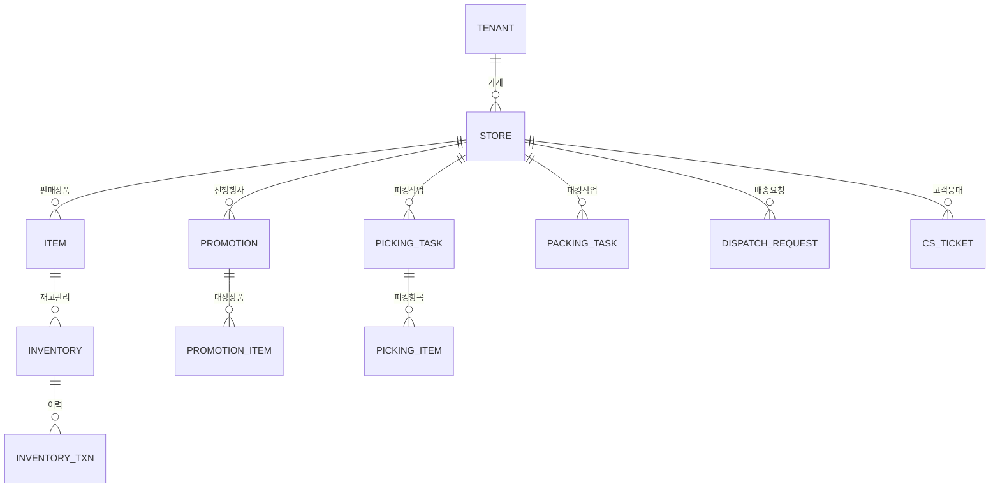

# 셀러박스 MVP PRD

## 🎯 핵심 정보

**목적**: 온라인 쇼핑몰에 입점한 가게 운영자가 상품·주문·배송·고객을 하나의 화면에서 처리하는 통합 운영 시스템  
**사용자**: 온라인 쇼핑몰 입점 가게의 사장(OWNER), 매장관리자(MANAGER), 피커(PICKER), 패커(PACKER)

---

## 🚶 사용자 여정

```
1. 관리자로그인 페이지
   ↓ 이메일/비밀번호 입력 → Supabase Auth 인증

2. 역할 분기
   OWNER/MANAGER → 가게관리 · 상품관리 · 배송현황판 접근 가능
   PICKER         → 피킹 작업 관리 페이지로 이동
   PACKER         → 패킹 작업 관리 페이지로 이동

3. 상품 운영 흐름
   상품관리 페이지 (등록/수정/삭제)
   ↓
   등록상품 재고관리 페이지 (재고 생성/조정/트랜잭션 조회)

4. 주문 처리 흐름
   피킹 작업 관리 페이지 (주문 피킹)
   ↓ 피킹 완료
   패킹 작업 관리 페이지 (주문 패킹)
   ↓ 패킹 완료
   라벨 관리 페이지 (ZPL 라벨 출력) + 피킹/패킹리스트 출력 페이지
   ↓
   배송 요청 관리 페이지 (배송 요청 생성)

5. 배송 처리 흐름
   바로퀵 마감 페이지 (배송전 마감처리)
   ↓
   배송라우팅 페이지 (배송순서 생성)
   ↓
   배송현황판 페이지 (실시간 모니터링)

6. 고객 지원 흐름
   고객 CS 페이지 (환불/교환/문의 처리)
   리뷰관리 페이지 (CEO 리뷰 답변 등록)
```

---

## ⚡ 기능 명세

### 1. MVP 핵심 기능

| ID | 기능명 | 설명 | MVP 필수 이유 | 관련 페이지 |
|----|--------|------|-------------|------------|
| **F001** | 상품 관리 | 가게 판매 상품 등록/수정/삭제 | 판매 상품 없이 운영 불가 | 상품관리 페이지 |
| **F002** | 재고 관리 | 카테고리별 상품 재고 생성/취소 및 트랜잭션 이력 조회 | 재고 초과 주문 방지 필수 | 등록상품 재고관리 페이지 |
| **F003** | 피킹 처리 | 주문별 주문상품 피킹 및 상태 관리 | 주문 처리 첫 단계 | 피킹 작업 관리 페이지 |
| **F004** | 패킹 처리 | 주문별 주문상품 패킹 및 상태 관리 | 배송 요청 전 필수 단계 | 패킹 작업 관리 페이지 |
| **F005** | 라벨 출력 | 송장·박스·봉투 ZPL 라벨 출력 | 물류 필수 | 라벨 관리 페이지 |
| **F006** | 피킹/패킹 리스트 출력 | 피킹·패킹 대상 주문별 상품 내용 출력 | 작업자 업무 가이드 필수 | 피킹/패킹리스트 출력 페이지 |
| **F007** | 배송 요청 생성 | 패킹 완료 주문의 배송요청 자료 생성 | 배송 연결 핵심 | 배송 요청 관리 페이지 |
| **F008** | 바로퀵 마감 | 배송요청건 배송전 마감 처리 | 바로퀵 정시 출발 보장 | 바로퀵 마감 페이지 |
| **F009** | 배송 라우팅 | 배송건에 대한 배송순서 생성 | 배송 효율화 | 배송라우팅 페이지 |
| **F010** | 배송 현황 모니터링 | 주문현황·배송완료·피킹패킹·배송중 건수 및 배송이벤트 실시간 조회 | 운영 가시성 필수 | 배송현황판 페이지 |

### 2. MVP 필수 지원 기능

| ID | 기능명 | 설명 | MVP 필수 이유 | 관련 페이지 |
|----|--------|------|-------------|------------|
| **F011** | 관리자 인증 | 역할 기반 로그인/로그아웃 (OWNER·MANAGER·PICKER·PACKER) | 서비스 접근 제어 | 관리자로그인 페이지 |
| **F012** | 가게 정보 관리 | 테넌트별 가게 기본정보 등록/수정/삭제 | 가게 운영 기반 설정 | 가게관리 페이지 |
| **F013** | 매장 상세 설정 | 배송정보·판매원·바로퀵정책·운행표·슬롯예약카운트 등록/수정/삭제 | 운영 환경 구성 필수 | 가게정보관리 페이지 |
| **F014** | 프로모션 관리 | 가게 프로모션 정보 등록/수정/삭제 | 판매 촉진 핵심 수단 | 프로모션 관리 페이지 |
| **F015** | 프로모션 상품 관리 | 프로모션 적용 상품 등록/수정/삭제 | 프로모션 실행 필수 | 프로모션 상품 관리 페이지 |
| **F016** | 쿠폰 등록 | 가게 쿠폰 등록/수정/삭제 | 할인 정책 운영 | 쿠폰등록 페이지 |
| **F017** | 쿠폰 발급/사용 | 쿠폰 발급 및 발급·사용 현황 조회 | 쿠폰 운영 가시성 | 쿠폰발급/사용 페이지 |
| **F018** | 광고 콘텐츠 관리 | 광고 내용(이미지·제목·링크) 등록/수정/삭제 | 입점 광고 운영 | 광고콘텐츠관리 페이지 |
| **F019** | 광고 일정 관리 | 광고 노출 기간 및 시간 설정 | 광고 스케줄 제어 | 광고일정 페이지 |
| **F020** | 광고 타겟 설정 | 광고 노출 대상(OS·버전·지역·세그먼트) 설정 | 광고 효율화 | 광고타겟 페이지 |
| **F021** | 광고 빈도 설정 | 광고 최대 노출·클릭 횟수 제한 설정 | 광고 과다 노출 방지 | 광고빈도 페이지 |
| **F022** | 광고 로그 조회 | 광고 노출·클릭 이벤트 로그 조회 | 광고 성과 확인 | 광고로그 페이지 |
| **F023** | 고객 CS 처리 | 환불·교환·문의 CS 처리 및 결과 등록/저장 | 고객 불만 해소 | 고객 CS 페이지 |
| **F024** | 리뷰 CEO 답변 | 앱 리뷰에 대한 CEO 답변 등록/수정 | 브랜드 신뢰도 관리 | 리뷰관리 페이지 |

### 3. MVP 이후 기능 (제외)

- 분석/통계 대시보드
- 외부 택배사 API 자동 연동
- 모바일 전용 앱
- 정산 관리

---

## 📱 메뉴 구조

```
📱 셀러박스 내비게이션

🔐 인증/계정 (비로그인 시)
└── 관리자로그인 — F011

🏪 매장 관리
└── 가게관리 — F012 + F013 (통합)
    ├── [테넌트 검색/선택 Grid]
    ├── [가게 목록 Grid] (선택된 테넌트의 가게)
    ├── [가게 상세 정보 폼] (가게 선택 시 표시)
    └── [가게정보 탭] (가게 선택 시 표시)
        ├── 배송정보 탭
        ├── 판매원정보 탭
        ├── 바로퀵정책 탭
        ├── 바로퀵고정운행표 탭
        └── 슬롯예약카운트 탭

📦 상품 관리
├── 상품 조회/목록 — F001 (화면번호: 11001)
└── 상품설명 관리 — F001-2 (화면번호: 11002)

🎉 프로모션 관리
├── 프로모션 관리 — F014
└── 프로모션 상품 관리 — F015

📊 재고 관리
└── 등록상품 재고관리 — F002

📢 광고관리
├── 광고콘텐츠관리 — F018
├── 광고일정 — F019
├── 광고타겟 — F020
├── 광고빈도 — F021
└── 광고로그 — F022

🎫 쿠폰관리
├── 쿠폰등록 — F016
└── 쿠폰발급/사용 — F017

🛒 주문 처리
├── 피킹 작업 관리 — F003
├── 패킹 작업 관리 — F004
├── 라벨 관리 — F005
└── 피킹/패킹리스트 출력 — F006

🚚 배송 관리
├── 배송 요청 관리 — F007
├── 바로퀵 마감 — F008
├── 배송라우팅 — F009
└── 배송현황판 — F010

👥 고객 지원
├── 고객 CS — F023
└── 리뷰관리 — F024
```

---

## 📄 페이지별 상세 기능

### 관리자로그인 페이지

> **구현 기능:** `F011` | **인증:** 불필요 (공개 페이지)

| 항목 | 내용 |
|------|------|
| **역할** | 판매자·관리자 계정 인증 전용 |
| **진입 경로** | 앱 첫 접속 또는 로그아웃 후 자동 리다이렉션 |
| **사용자 행동** | 이메일·비밀번호 입력 후 로그인 버튼 클릭 |
| **주요 기능** | • 이메일/비밀번호 유효성 검사<br>• Supabase Auth 인증 처리<br>• 역할(OWNER·MANAGER·PICKER·PACKER) 확인<br>• **로그인** 버튼 |
| **다음 이동** | 성공 → 역할별 기본 페이지, 실패 → 오류 메시지 표시 |

---

### 가게관리 페이지

> **구현 기능:** `F012` + `F013` (통합) | **인증:** OWNER·MANAGER

| 항목 | 내용 |
|------|------|
| **역할** | 테넌트 → 가게 → 가게상세의 마스터-디테일 3단 구조로 가게 기본정보 및 운영 상세 설정을 통합 관리 |
| **진입 경로** | 메뉴 → 매장 관리 → 가게관리 클릭 |
| **사용자 행동** | 테넌트 검색/선택 → 가게 목록 조회 → 가게 선택 시 상세폼 + 탭 표시 |
| **화면 구조** | **① 테넌트 Grid** (상단): 테넌트명·코드 검색 + 조회/초기화 버튼 + 테넌트 목록 테이블<br>**② 가게 Grid** (중단): 선택된 테넌트의 가게 목록 + 행추가/행삭제 버튼<br>**③ 가게 상세 폼** (하단, 가게 선택 시): 가게 전체 필드 편집 폼 (가게정보·포인트·운영·사업자) + 닫기/저장 버튼<br>**④ 가게정보 탭** (가게 선택 시): 배송정보·판매원·바로퀵정책·운행표·슬롯카운트 각 탭 CRUD |
| **주요 기능** | • [테넌트 Grid] 테넌트명·코드 클라이언트 사이드 검색 + 행 선택<br>• [가게 Grid] 선택 테넌트의 가게 목록, 가게 등록(다이얼로그), 가게 삭제<br>• [가게 상세 폼] 가게 전체 필드 (기본정보·포인트·배달시간·운영·사업자) 수정/저장<br>• [배송정보 탭] 배송 풀필먼트 유형 등록/수정/삭제<br>• [판매원정보 탭] 판매원 계정 등록/수정/삭제 (role: PICKER·PACKER 포함)<br>• [바로퀵정책 탭] 최소주문금액·일일운행횟수·슬롯용량·상태 설정<br>• [바로퀵고정운행표 탭] 출발시간·요일마스크·오더컷오프 설정<br>• [슬롯예약카운트 탭] 날짜·시간별 예약 건수 조회 및 설정 |
| **다음 이동** | 저장 성공 → 목록/폼 갱신, 실패 → 오류 메시지 표시 |

> ⚠️ **변경 이력**: 기존 별도 페이지였던 `가게정보관리`(F013)는 `가게관리` 페이지에 통합되었습니다. `/stores/info` 접근 시 `/stores`로 자동 리다이렉트됩니다.

---

### 상품 조회/목록 페이지 (화면번호: 11001)

> **구현 기능:** `F001` | **인증:** OWNER·MANAGER

| 항목 | 내용 |
|------|------|
| **역할** | 가게에서 판매하는 상품 정보를 등록·수정·삭제하는 핵심 상품 관리 |
| **진입 경로** | 메뉴 → 상품 관리 → 상품 조회/목록 클릭 |
| **사용자 행동** | 검색조건 입력 후 조회, 상품 목록 확인, 상품 등록·수정·삭제 |
| **화면 구조** | **① 검색조건 영역** (상단): 가게명(Select) + 카테고리(Select) + 조회/초기화 버튼<br>**② 상품 목록 그리드**: SKU·상품명·카테고리·판매가·상태 + 상품등록/수정/삭제 액션 |
| **주요 기능** | • **[검색조건]** 가게명: 로그인 사용자의 소속 가게 선택 (OWNER는 복수 가게 지원)<br>• **[검색조건]** 카테고리: 전체 또는 특정 카테고리 필터<br>• **[검색조건]** 조회 버튼: URL 파라미터(`store_id`, `category`) 기반 서버 재조회<br>• 상품 목록 테이블 (SKU·상품명·카테고리·판매가·상태)<br>• 상품 등록/수정 폼 (SKU·카테고리·이름·가격·이미지·상태) — LayerDialog<br>• 상품 상태 변경 (ACTIVE·INACTIVE·OUT_OF_STOCK·DISCONTINUED)<br>• 상품 이미지 업로드 (Supabase Storage)<br>• **상품 등록** / **수정** / **삭제** 버튼 |
| **업무 규칙** | OWNER는 하나 이상의 가게를 운영할 수 있음 — seller 테이블에 동일 email로 복수 레코드 허용 (각각 다른 store_id) |
| **다음 이동** | 저장 성공 → 상품 목록 갱신, 실패 → 오류 메시지 표시 |

---

### 상품설명 관리 페이지 (화면번호: 11002)

> **구현 기능:** `F001-2` | **인증:** OWNER·MANAGER

| 항목 | 내용 |
|------|------|
| **역할** | 상품(item)의 상세 설명 정보(item_detail) — 짧은설명, 5종 이미지 — 를 등록·수정·삭제하는 화면 |
| **진입 경로** | 메뉴 → 상품 관리 → 상품설명 관리 클릭 |
| **사용자 행동** | 가게+카테고리 조회 → 상품 그리드에서 상품 선택 → item_detail 폼 입력/수정 → 저장 |
| **화면 구조** | **① 검색조건 영역** (상단): 가게명(Select) + 카테고리(Select) + 조회/초기화 버튼<br>**② 상품목록 그리드** (중단): 조회된 item 목록, 행 선택 시 하단 폼 연동, 행삭제 버튼<br>**③ 상품설명 입력/수정 영역** (하단, 상품 선택 시 표시): item_detail 전체 필드 + 닫기/저장 버튼 |
| **주요 기능** | • **[조회]** store → item → item_detail 순서로 데이터 조회<br>• **[행 선택]** 상품 클릭 → item_detail 존재 시 폼 바인딩, 없으면 신규 입력 폼 표시<br>• **[행삭제]** 선택된 item_detail → ConfirmDialog → INACTIVE 처리 (소프트 삭제)<br>• **[저장]** item_detail_id 유무에 따라 INSERT/UPDATE 분기<br>• **[닫기]** 변경사항 있을 시 "저장 여부" 확인 다이얼로그<br>• 상품설명ID, 상품명, 가게명 (읽기전용)<br>• 짧은설명 (textarea)<br>• 상품이미지 (375×375px), 상품상세이미지-광고 (340×420px), 상품상세이미지-상세 (340×420px)<br>• 상품이미지 썸네일(소) (80×80px), 상품이미지 썸네일(대) (110×110px)<br>• 생성일시, 수정일시 (읽기전용), 상태 (ACTIVE·INACTIVE) |
| **데이터** | item 테이블 + item_detail 테이블 |
| **다음 이동** | 저장 성공 → 폼 dirty 상태 초기화, 실패 → 오류 메시지 표시 |

---

### 프로모션 관리 페이지

> **구현 기능:** `F014` | **인증:** OWNER·MANAGER

| 항목 | 내용 |
|------|------|
| **역할** | 가게에서 진행하는 프로모션(행사) 정보 관리 |
| **진입 경로** | 메뉴 → 프로모션 관리 → 프로모션 관리 클릭 |
| **사용자 행동** | 프로모션 목록 조회, 신규 프로모션 등록, 기존 프로모션 수정·삭제 |
| **주요 기능** | • 프로모션 목록 테이블 (이름·유형·기간·상태)<br>• 프로모션 등록/수정 폼 (이름·타입·할인값·플래시세일·시작/종료일시)<br>• 프로모션 상태 관리 (SCHEDULED·ACTIVE·PAUSED·ENDED)<br>• **등록** / **수정** / **삭제** 버튼 |
| **다음 이동** | 저장 성공 → 프로모션 목록 갱신, 실패 → 오류 메시지 표시 |

---

### 프로모션 상품 관리 페이지

> **구현 기능:** `F015` | **인증:** OWNER·MANAGER

| 항목 | 내용 |
|------|------|
| **역할** | 프로모션에 적용할 대상 상품 연결·관리 |
| **진입 경로** | 메뉴 → 프로모션 관리 → 프로모션 상품 관리 클릭 |
| **사용자 행동** | 프로모션 선택 후 적용 상품 등록·삭제, N+1 조건 설정 |
| **주요 기능** | • 프로모션 선택 드롭다운<br>• 적용 상품 목록 (상품명·조건수량·보상수량·주문한도·상태)<br>• 상품 추가 폼 (조건수량·보상수량·대체상품 설정 포함)<br>• **상품 추가** / **삭제** 버튼 |
| **다음 이동** | 저장 성공 → 적용 상품 목록 갱신, 실패 → 오류 메시지 표시 |

---

### 등록상품 재고관리 페이지

> **구현 기능:** `F002` | **인증:** OWNER·MANAGER

| 항목 | 내용 |
|------|------|
| **역할** | 카테고리별 상품 재고 현황 조회, 재고 생성/취소 및 트랜잭션 이력 관리 |
| **진입 경로** | 메뉴 → 재고 관리 → 등록상품 재고관리 클릭 |
| **사용자 행동** | 카테고리 필터로 상품 조회, 재고 수량 조정, 트랜잭션 이력 확인 |
| **주요 기능** | • 카테고리별 상품 목록 (상품명·보유재고·홀드수량·안전재고·상태)<br>• 재고 생성(INBOUND) / 취소(ADJUST) 처리<br>• 트랜잭션 이력 조회 (유형·이동수량·이동전후 재고·사유)<br>• **재고 조정** / **이력 조회** 버튼 |
| **다음 이동** | 조정 성공 → 재고 수량 갱신, 실패 → 오류 메시지 표시 |

---

### 광고콘텐츠관리 페이지

> **구현 기능:** `F018` | **인증:** OWNER·MANAGER

| 항목 | 내용 |
|------|------|
| **역할** | 앱에 노출되는 광고 이미지·제목·링크 등 콘텐츠 등록·수정·삭제 |
| **진입 경로** | 메뉴 → 광고관리 → 광고콘텐츠관리 클릭 |
| **사용자 행동** | 광고 콘텐츠 목록 조회, 신규 광고 등록, 기존 광고 수정·삭제 |
| **주요 기능** | • 광고 콘텐츠 목록 (제목·배치·우선순위·상태)<br>• 광고 등록/수정 폼 (제목·광고이미지·클릭URL·우선순위)<br>• 광고 상태 관리 (DRAFT·READY·ACTIVE·PAUSED·ENDED)<br>• **등록** / **수정** / **삭제** 버튼 |
| **다음 이동** | 저장 성공 → 광고 목록 갱신, 실패 → 오류 메시지 표시 |

---

### 광고일정 페이지

> **구현 기능:** `F019` | **인증:** OWNER·MANAGER

| 항목 | 내용 |
|------|------|
| **역할** | 광고 콘텐츠의 노출 기간·시간대·요일 스케줄 등록·수정·삭제 |
| **진입 경로** | 메뉴 → 광고관리 → 광고일정 클릭 |
| **사용자 행동** | 광고 선택 후 노출 일정(기간·시간·요일) 설정 |
| **주요 기능** | • 광고 선택 드롭다운<br>• 일정 목록 (시작일시·종료일시·시간대·요일마스크·상태)<br>• 일정 등록/수정 폼 (start_at·end_at·time_start·time_end·dow_mask)<br>• **일정 등록** / **삭제** 버튼 |
| **다음 이동** | 저장 성공 → 일정 목록 갱신, 실패 → 오류 메시지 표시 |

---

### 광고타겟 페이지

> **구현 기능:** `F020` | **인증:** OWNER·MANAGER

| 항목 | 내용 |
|------|------|
| **역할** | 광고 노출 대상(OS·앱버전·지역·사용자 세그먼트) 조건 설정 |
| **진입 경로** | 메뉴 → 광고관리 → 광고타겟 클릭 |
| **사용자 행동** | 광고 선택 후 타겟 조건 등록·수정·삭제 |
| **주요 기능** | • 타겟 목록 (OS·앱버전범위·지역·세그먼트·상태)<br>• 타겟 등록/수정 폼 (OS·버전범위·locale·region·user_segment)<br>• 타겟 상태 관리 (ACTIVE·INACTIVE)<br>• **타겟 등록** / **삭제** 버튼 |
| **다음 이동** | 저장 성공 → 타겟 목록 갱신, 실패 → 오류 메시지 표시 |

---

### 광고빈도 페이지

> **구현 기능:** `F021` | **인증:** OWNER·MANAGER

| 항목 | 내용 |
|------|------|
| **역할** | 광고 최대 노출·클릭 횟수 상한 설정으로 과다 노출 방지 |
| **진입 경로** | 메뉴 → 광고관리 → 광고빈도 클릭 |
| **사용자 행동** | 광고 선택 후 노출·클릭 한도 등록·수정·삭제 |
| **주요 기능** | • 빈도 목록 (광고명·전체노출한도·1일/인 노출한도·전체클릭한도·상태)<br>• 빈도 등록/수정 폼 (max_impressions_total·max_impressions_per_user_day·max_clicks_total)<br>• **저장** / **삭제** 버튼 |
| **다음 이동** | 저장 성공 → 빈도 목록 갱신, 실패 → 오류 메시지 표시 |

---

### 광고로그 페이지

> **구현 기능:** `F022` | **인증:** OWNER·MANAGER

| 항목 | 내용 |
|------|------|
| **역할** | 광고 노출(IMPRESSION)·클릭(CLICK) 이벤트 이력 조회 전용 |
| **진입 경로** | 메뉴 → 광고관리 → 광고로그 클릭 |
| **사용자 행동** | 기간·광고·액션 유형 필터 적용 후 로그 조회 |
| **주요 기능** | • 로그 목록 테이블 (광고명·액션·페이지·지면키·발생시각·IP)<br>• 날짜 범위 필터, 광고 선택 필터, 액션 유형 필터<br>• 조회 전용 (수정/삭제 없음) |
| **다음 이동** | 필터 변경 → 목록 실시간 갱신 |

---

### 쿠폰등록 페이지

> **구현 기능:** `F016` | **인증:** OWNER·MANAGER

| 항목 | 내용 |
|------|------|
| **역할** | 가게 쿠폰 정책 등록·수정·삭제 |
| **진입 경로** | 메뉴 → 쿠폰관리 → 쿠폰등록 클릭 |
| **사용자 행동** | 쿠폰 목록 조회, 신규 쿠폰 등록, 기존 쿠폰 수정·삭제 |
| **주요 기능** | • 쿠폰 목록 테이블 (쿠폰명·유형·할인값·유효기간·발급수·상태)<br>• 쿠폰 등록/수정 폼 (이름·유형·할인단위·할인값·최소주문금액·유효기간·발급한도)<br>• 쿠폰 상태 관리 (ACTIVE·ISSUED·USED·EXPIRED·CANCELLED)<br>• **등록** / **수정** / **삭제** 버튼 |
| **다음 이동** | 저장 성공 → 쿠폰 목록 갱신, 실패 → 오류 메시지 표시 |

---

### 쿠폰발급/사용 페이지

> **구현 기능:** `F017` | **인증:** OWNER·MANAGER

| 항목 | 내용 |
|------|------|
| **역할** | 쿠폰 발급 실행 및 발급·사용 현황 조회 |
| **진입 경로** | 메뉴 → 쿠폰관리 → 쿠폰발급/사용 클릭 |
| **사용자 행동** | 쿠폰 선택 후 고객에게 발급, 발급·사용 이력 조회 |
| **주요 기능** | • 발급 목록 테이블 (고객ID·발급일시·만료일시·사용상태)<br>• 쿠폰 발급 폼 (쿠폰 선택·고객 지정 또는 전체 발급)<br>• 사용 이력 조회 (사용일시·할인금액·주문 연결)<br>• **발급** / **이력 조회** 버튼 |
| **다음 이동** | 발급 성공 → 발급 목록 갱신, 실패 → 오류 메시지 표시 |

---

### 피킹 작업 관리 페이지

> **구현 기능:** `F003` | **인증:** PICKER·MANAGER

| 항목 | 내용 |
|------|------|
| **역할** | 주문별 상품 피킹 작업 지정 및 상태 관리 |
| **진입 경로** | 메뉴 → 주문 처리 → 피킹 작업 관리 클릭, 또는 PICKER 로그인 시 자동 이동 |
| **사용자 행동** | 피킹 대상 주문 목록 조회, 피킹 시작·완료 처리 |
| **주요 기능** | • 피킹 대상 주문 목록 (주문번호·상품수·피커·상태: CREATED·PICKING·PICKED·FAILED)<br>• 피킹 상세: 주문별 상품 목록 (요청수량·피킹수량·결과·대체상품)<br>• 피킹 시작 / 완료 / 실패 상태 전환<br>• **피킹 시작** / **완료 처리** 버튼 |
| **다음 이동** | 피킹 완료 → 패킹 작업 관리 페이지로 이동 권장 |

---

### 패킹 작업 관리 페이지

> **구현 기능:** `F004` | **인증:** PACKER·MANAGER

| 항목 | 내용 |
|------|------|
| **역할** | 피킹 완료 주문의 패킹 작업 처리 및 상태 관리 |
| **진입 경로** | 메뉴 → 주문 처리 → 패킹 작업 관리 클릭, 또는 PACKER 로그인 시 자동 이동 |
| **사용자 행동** | 패킹 대상 주문 목록 조회, 패킹 시작·완료 처리, 패킹 중량 입력 |
| **주요 기능** | • 패킹 대상 주문 목록 (주문번호·패커·패킹중량·상태: READY·PACKING·PACKED)<br>• 패킹 상세: 주문 상품 내역 확인<br>• 패킹 중량 입력 및 완료 처리<br>• **패킹 시작** / **완료 처리** 버튼 |
| **다음 이동** | 패킹 완료 → 라벨 관리 페이지 또는 배송 요청 관리 페이지 이동 |

---

### 라벨 관리 페이지

> **구현 기능:** `F005` | **인증:** MANAGER·PACKER

| 항목 | 내용 |
|------|------|
| **역할** | 패킹 완료 주문의 송장·박스·봉투 ZPL 라벨 출력 |
| **진입 경로** | 메뉴 → 주문 처리 → 라벨 관리 클릭 |
| **사용자 행동** | 출력 대상 주문 선택 후 라벨 유형 선택, 출력 실행 |
| **주요 기능** | • 라벨 출력 대상 주문 목록 (주문번호·라벨유형·출력일시)<br>• 라벨 유형 선택 (BOX·BAG·INVOICE)<br>• ZPL 텍스트 미리보기 및 인쇄 실행<br>• **라벨 출력** 버튼 |
| **다음 이동** | 출력 성공 → 출력일시 기록, 실패 → 오류 메시지 표시 |

---

### 피킹/패킹리스트 출력 페이지

> **구현 기능:** `F006` | **인증:** MANAGER·PICKER·PACKER

| 항목 | 내용 |
|------|------|
| **역할** | 피킹·패킹 작업자를 위한 주문별 상품 내용 목록 출력 |
| **진입 경로** | 메뉴 → 주문 처리 → 피킹/패킹리스트 출력 클릭 |
| **사용자 행동** | 날짜·작업 유형(피킹/패킹) 선택 후 목록 출력 |
| **주요 기능** | • 날짜·상태 필터로 대상 주문 조회<br>• 피킹리스트: 주문별 상품명·수량·카테고리 목록<br>• 패킹리스트: 주문별 상품·피킹결과·패킹중량 목록<br>• **인쇄** / **PDF 출력** 버튼 |
| **다음 이동** | 출력 완료 → 동일 페이지 유지 |

---

### 배송 요청 관리 페이지

> **구현 기능:** `F007` | **인증:** MANAGER

| 항목 | 내용 |
|------|------|
| **역할** | 패킹 완료 주문의 배송요청 자료 생성 및 상태 관리 |
| **진입 경로** | 메뉴 → 배송 관리 → 배송 요청 관리 클릭 |
| **사용자 행동** | 패킹 완료 주문 선택 후 배송 요청 생성 |
| **주요 기능** | • 배송 요청 대상 주문 목록 (주문번호·배송요청상태: REQUESTED·ASSIGNED·CANCELLED)<br>• 배송 요청 생성 (라이더 배정 대기)<br>• 요청 취소 처리<br>• **배송 요청** / **취소** 버튼 |
| **다음 이동** | 요청 성공 → 배송 요청 목록 갱신, 실패 → 오류 메시지 표시 |

---

### 바로퀵 마감 페이지

> **구현 기능:** `F008` | **인증:** MANAGER

| 항목 | 내용 |
|------|------|
| **역할** | 바로퀵 배송 요청건의 배송전 마감 처리 |
| **진입 경로** | 메뉴 → 배송 관리 → 바로퀵 마감 클릭 |
| **사용자 행동** | 마감 대상 배송요청 확인 후 마감 처리 실행 |
| **주요 기능** | • 마감 대상 요청 목록 (슬롯 시간·요청건수·상태)<br>• 슬롯별 배송요청 상세 조회<br>• 마감 처리 (출발 확정)<br>• **마감 처리** 버튼 |
| **다음 이동** | 마감 성공 → 배송라우팅 페이지 이동 권장 |

---

### 배송라우팅 페이지

> **구현 기능:** `F009` | **인증:** MANAGER

| 항목 | 내용 |
|------|------|
| **역할** | 마감된 배송건에 대한 최적 배송순서 생성 |
| **진입 경로** | 메뉴 → 배송 관리 → 배송라우팅 클릭 |
| **사용자 행동** | 배송 대상 선택 후 라우팅 순서 생성 및 확인 |
| **주요 기능** | • 배송 대상 목록 (주문번호·배송지·거리)<br>• 배송순서 생성 실행<br>• 생성된 배송순서 목록 확인<br>• **순서 생성** / **확정** 버튼 |
| **다음 이동** | 확정 → 배송현황판 페이지에 반영 |

---

### 배송현황판 페이지

> **구현 기능:** `F010` | **인증:** OWNER·MANAGER

| 항목 | 내용 |
|------|------|
| **역할** | 주문·배송 현황 실시간 모니터링 대시보드 |
| **진입 경로** | 메뉴 → 배송 관리 → 배송현황판 클릭 |
| **사용자 행동** | 현황 카드·테이블 조회, 배송이벤트 확인 |
| **주요 기능** | • 현황 카드: 주문건수·배송완료·피킹패킹+배송요청현황·배송중 건수<br>• 배송이벤트 이력 목록 (이벤트코드·메모·발생시각)<br>• Supabase Realtime 구독으로 자동 갱신<br>• **새로고침** 버튼 |
| **다음 이동** | 항목 클릭 → 해당 주문·배송 상세 팝업 표시 |

---

### 고객 CS 페이지

> **구현 기능:** `F023` | **인증:** MANAGER

| 항목 | 내용 |
|------|------|
| **역할** | 배송 관련 환불·교환·문의 CS 접수 및 처리 결과 등록·저장 |
| **진입 경로** | 메뉴 → 고객 지원 → 고객 CS 클릭 |
| **사용자 행동** | CS 티켓 목록 조회, 처리 내용·결과 입력 후 저장 |
| **주요 기능** | • CS 티켓 목록 (주문번호·유형·접수일·상태: OPEN·IN_PROGRESS·CLOSED)<br>• CS 상세: CS내용·처리방법 입력 폼<br>• 티켓 상태 전환 (OPEN→IN_PROGRESS→CLOSED)<br>• **저장** / **닫기** 버튼 |
| **다음 이동** | 저장 성공 → 티켓 목록 갱신, 실패 → 오류 메시지 표시 |

---

### 리뷰관리 페이지

> **구현 기능:** `F024` | **인증:** OWNER·MANAGER

| 항목 | 내용 |
|------|------|
| **역할** | 온라인 주문앱(프레시픽) 고객 리뷰에 대한 CEO 답변 등록·수정 |
| **진입 경로** | 메뉴 → 고객 지원 → 리뷰관리 클릭 |
| **사용자 행동** | 리뷰 목록 조회 후 미답변 리뷰 선택, CEO 답변 작성 후 등록 |
| **주요 기능** | • 리뷰 목록 테이블 (상품명·별점·리뷰내용·작성일·답변여부)<br>• 리뷰 상태 필터 (VISIBLE·HIDDEN·REPORTED·DELETED)<br>• CEO 답변 등록/수정 폼<br>• **답변 등록** / **수정** 버튼 |
| **다음 이동** | 저장 성공 → 리뷰 목록 답변여부 갱신, 실패 → 오류 메시지 표시 |

---

## 🗄️ 데이터 모델

### ERD 핵심 관계



### 테이블 정의

#### seller (판매원)
| 필드 | 설명 | 타입/관계 |
|------|------|----------|
| seller_id | 판매원 고유 ID | UUID |
| email | 이메일 | VARCHAR |
| role | 역할 | ENUM: OWNER·MANAGER·PICKER·PACKER |
| store_id | 소속 가게 | → store.store_id |
| is_active | 활성여부 | ENUM: ACTIVE·INACTIVE |

#### store (가게)
| 필드 | 설명 | 타입/관계 |
|------|------|----------|
| store_id | 가게 고유 ID | UUID |
| tenant_id | 테넌트 | → tenant.tenant_id |
| name | 가게 이름 | VARCHAR |
| store_category | 가게 카테고리 | VARCHAR |
| status | 운영 상태 | ENUM: ACTIVE·INACTIVE·CLOSED·PENDING |

#### item (상품)
| 필드 | 설명 | 타입/관계 |
|------|------|----------|
| item_id | 상품 고유 ID | UUID |
| store_id | 소속 가게 | → store.store_id |
| sku | 상품 관리번호 | CHAR(13) |
| category_code_value | 카테고리 코드 | VARCHAR |
| name | 상품명 | VARCHAR |
| list_price | 정가 | INT |
| sale_price | 판매가 | INT |
| status | 판매 상태 | ENUM: ACTIVE·INACTIVE·OUT_OF_STOCK·DISCONTINUED |

#### inventory (재고)
| 필드 | 설명 | 타입/관계 |
|------|------|----------|
| inventory_id | 재고 고유 ID | UUID |
| item_id | 상품 | → item.item_id |
| store_id | 가게 | → store.store_id |
| on_hand | 보유 가용 재고 | INT |
| reserved | 홀드 수량 | INT |
| safety_stock | 안전재고 | INT |

#### inventory_txn (재고 트랜잭션)
| 필드 | 설명 | 타입/관계 |
|------|------|----------|
| txnId | 트랜잭션 ID | UUID |
| inventory_id | 재고 | → inventory.inventory_id |
| type | 트랜잭션 유형 | INBOUND·OUTBOUND·ADJUST·RESERVE·RELEASE·RETURN |
| quantity | 이동 수량 | INT |
| before_quantity | 이동 전 재고 | INT |
| after_quantity | 이동 후 재고 | INT |

#### order (주문)
| 필드 | 설명 | 타입/관계 |
|------|------|----------|
| order_id | 주문 ID | UUID |
| store_id | 가게 | → store.store_id |
| order_no | 주문번호 | CHAR(30) UNIQUE |
| status | 주문 상태 | ENUM: CREATED·PAID·PACKING·DISPATCHED·DELIVERING·DELIVERED·CANCELED·REFUNDED |
| ordered_at | 주문 일시 | DATETIME |
| final_payable | 최종 결제금액 | DECIMAL |

#### order_item (주문 상세)
| 필드 | 설명 | 타입/관계 |
|------|------|----------|
| order_detail_id | 주문 상세 ID | UUID |
| order_id | 주문 | → order.order_id |
| item_id | 상품 | → item.item_id |
| qty | 주문 수량 | INT |
| unit_price | 단가 | DECIMAL |
| status | 상세 상태 | ENUM: ORDERED·PACKING·SHIPPED·DELIVERED·CANCELED |

#### picking_task (피킹 작업)
| 필드 | 설명 | 타입/관계 |
|------|------|----------|
| task_id | 피킹 작업 ID | UUID |
| order_id | 주문 | → order.order_id |
| picker_id | 피커 | → seller.seller_id |
| status | 작업 상태 | ENUM: CREATED·PICKING·PICKED·FAILED |
| completed_at | 완료 일시 | DATETIME |

#### picking_item (피킹 항목)
| 필드 | 설명 | 타입/관계 |
|------|------|----------|
| picking_item_id | 피킹 항목 ID | UUID |
| task_id | 피킹 작업 | → picking_task.task_id |
| order_item_id | 주문 항목 | → order_item.order_detail_id |
| requested_qty | 요청 수량 | INT |
| picked_qty | 피킹 수량 | INT |
| result | 피킹 결과 | ENUM: OK·SHORT·SUBSTITUTE |

#### packing_task (패킹 작업)
| 필드 | 설명 | 타입/관계 |
|------|------|----------|
| pack_id | 패킹 작업 ID | UUID |
| order_id | 주문 | → order.order_id |
| packer_id | 패커 | → seller.seller_id |
| status | 작업 상태 | ENUM: READY·PACKING·PACKED |
| packing_weight | 패킹 중량 | DECIMAL |

#### label (라벨)
| 필드 | 설명 | 타입/관계 |
|------|------|----------|
| label_id | 라벨 ID | UUID |
| order_id | 주문 | → order.order_id |
| zpl_text | ZPL 텍스트 | TEXT |
| label_type | 라벨 유형 | ENUM: BOX·BAG·INVOICE |
| printed_at | 출력 일시 | DATETIME |

#### shipment (배송)
| 필드 | 설명 | 타입/관계 |
|------|------|----------|
| shipment_id | 배송 ID | UUID |
| order_id | 주문 | → order.order_id |
| tracking_no | 운송장번호 | VARCHAR |
| method | 배송 방법 | ENUM: QUICK·RO_ONDEMAND |
| status | 배송 상태 | ENUM: READY·ASSIGNED·PICKED_UP·OUT_FOR_DELIVERY·DELIVERED·FAILED·SCHEDULED |

#### dispatch_request (배송 요청)
| 필드 | 설명 | 타입/관계 |
|------|------|----------|
| dispatch_id | 배송요청 ID | UUID |
| order_id | 주문 | → order.order_id |
| store_id | 가게 | → store.store_id |
| status | 요청 상태 | ENUM: REQUESTED·ASSIGNED·CANCELLED |
| rider_id | 라이더 | → rider.rider_id |

#### promotion (프로모션)
| 필드 | 설명 | 타입/관계 |
|------|------|----------|
| promo_id | 프로모션 ID | UUID |
| store_id | 가게 | → store.store_id |
| name | 프로모션명 | VARCHAR |
| type | 프로모션 유형 | ENUM: SALE·DISCOUNT_PCT·DISCOUNT_FIXED·ONE_PLUS_ONE·TWO_PLUS_ONE·BUNDLE |
| status | 상태 | ENUM: SCHEDULED·ACTIVE·PAUSED·ENDED |

#### coupon (쿠폰)
| 필드 | 설명 | 타입/관계 |
|------|------|----------|
| coupon_id | 쿠폰 ID | UUID |
| store_id | 가게 | → store.store_id |
| coupon_type | 쿠폰 유형 | ENUM: DISCOUNT·SHIPPING_FREE·SIGNUP |
| discount_value | 할인 값 | DECIMAL |
| valid_from | 유효 시작 | DATETIME |
| valid_to | 유효 종료 | DATETIME |

#### cs_ticket (CS 티켓)
| 필드 | 설명 | 타입/관계 |
|------|------|----------|
| ticket_id | CS 티켓 ID | UUID |
| order_id | 주문 | → order.order_id |
| type | CS 유형 | ENUM: REFUND·EXCHANGE·INQUIRY |
| cs_contents | CS 내용 | VARCHAR |
| cs_action | CS 처리결과 | VARCHAR |
| status | 처리 상태 | ENUM: OPEN·IN_PROGRESS·CLOSED |

#### review (리뷰) + ceo_review (CEO 답변)
| 필드 | 설명 | 타입/관계 |
|------|------|----------|
| review_id | 리뷰 ID | UUID |
| store_id | 가게 | → store.store_id |
| rating | 별점 | INT |
| content | 리뷰 내용 | VARCHAR |
| status | 리뷰 상태 | ENUM: VISIBLE·HIDDEN·REPORTED·DELETED |
| — (ceo_review) | CEO 답변 | → review.review_id |

#### fp_ad_content (광고 콘텐츠)
| 필드 | 설명 | 타입/관계 |
|------|------|----------|
| content_id | 광고 ID | UUID |
| store_id | 가게 | → store.store_id |
| title | 광고 제목 | VARCHAR |
| ad_image | 광고 이미지 | MEDIUMBLOB |
| status | 상태 | ENUM: DRAFT·READY·ACTIVE·PAUSED·ENDED |

---

## 🛠️ 기술 스택

### 🎨 프론트엔드 프레임워크

- **Next.js 15** (App Router) - React 풀스택 프레임워크
- **TypeScript 5.6+** - 타입 안전성 보장
- **React 19** - UI 라이브러리 (최신 동시성 기능)

### 🎨 스타일링 & UI

- **TailwindCSS v4** (설정파일 없는 새로운 엔진) - 유틸리티 CSS 프레임워크
- **shadcn/ui** - 고품질 React 컴포넌트 라이브러리
- **Lucide React** - 아이콘 라이브러리

### 📝 폼 & 검증

- **React Hook Form 7.x** - 폼 상태 관리
- **Zod** - 스키마 검증 라이브러리

### 🗄️ 백엔드 & 데이터베이스

- **Supabase** - BaaS (인증·PostgreSQL·실시간 구독·Storage)
  - **Supabase Auth** - 역할 기반 인증 (seller.role)
  - **Supabase Realtime** - 배송현황판 실시간 구독
  - **Supabase Storage** - 상품 이미지·광고 이미지 파일 처리
- **PostgreSQL** - 관계형 데이터베이스 (Supabase 내장)
- **Next.js API Routes** - 서버사이드 비즈니스 로직

### 🚀 배포 & 호스팅

- **Vercel** - Next.js 15 최적화 배포 플랫폼

### 📦 패키지 관리

- **npm** - 의존성 관리
