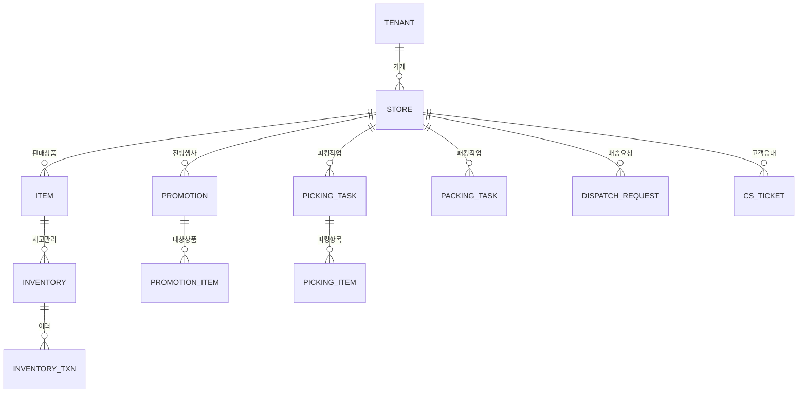

# 셀러박스 MVP PRD

## 🎯 핵심 정보

**목적**: 온라인 쇼핑몰에 입점한 가게 운영자가 상품·주문·배송·고객을 하나의 화면에서 처리하는 통합 운영 시스템  
**사용자**: 온라인 쇼핑몰 입점 가게의 사장(OWNER), 매장관리자(MANAGER), 피커(PICKER), 패커(PACKER)

---

## 🚶 사용자 여정

```
1. 관리자로그인 페이지
   ↓ 이메일/비밀번호 입력 → Supabase Auth 인증

2. 역할 분기
   OWNER/MANAGER → 가게관리 · 상품관리 · 배송현황판 접근 가능
   PICKER         → 피킹 작업 관리 페이지로 이동
   PACKER         → 패킹 작업 관리 페이지로 이동

3. 상품 운영 흐름
   상품관리 페이지 (등록/수정/삭제)
   ↓
   등록상품 재고관리 페이지 (재고 생성/조정/트랜잭션 조회)

4. 주문 처리 흐름
   주문처리 통합 화면 (피킹→패킹→라벨출력→피킹/패킹리스트 출력→배송요청 일괄 처리)
   ↓ 배송요청 완료

5. 배송 처리 흐름
   배송관리 통합 화면 (배송출발·완료 처리 + BBQ 배송지별 묶음 조회)
   ↓
   배송현황판 페이지 (실시간 모니터링)

6. 고객 지원 흐름
   고객 CS 페이지 (환불/교환/문의 처리)
   리뷰관리 페이지 (CEO 리뷰 답변 등록)
```

---

## ⚡ 기능 명세

### 1. MVP 핵심 기능

| ID | 기능명 | 설명 | MVP 필수 이유 | 관련 페이지 |
|----|--------|------|-------------|------------|
| **F001** | 상품 관리 | 가게 판매 상품 등록/수정/삭제 | 판매 상품 없이 운영 불가 | 상품관리 페이지 |
| **F002** | 재고 관리 | 카테고리별 상품 재고 생성/취소 및 트랜잭션 이력 조회 | 재고 초과 주문 방지 필수 | 등록상품 재고관리 페이지 |
| **F003** | 피킹 처리 | 주문별 주문상품 피킹 및 상태 관리 | 주문 처리 첫 단계 | 피킹 작업 관리 페이지 |
| **F004** | 패킹 처리 | 주문별 주문상품 패킹 및 상태 관리 | 배송 요청 전 필수 단계 | 패킹 작업 관리 페이지 |
| **F005** | 라벨 출력 | 송장·박스·봉투 ZPL 라벨 출력 | 물류 필수 | 라벨 관리 페이지 |
| **F006** | 피킹/패킹 리스트 출력 | 피킹·패킹 대상 주문별 상품 내용 출력 | 작업자 업무 가이드 필수 | 피킹/패킹리스트 출력 페이지 |
| **F007** | 배송 요청 생성 | 패킹 완료 주문의 배송요청 자료 생성 | 배송 연결 핵심 | 배송관리 통합 화면 |
| **F008** | 배송 출발·완료 | 배송건 일괄 출발/완료 처리, BBQ 배송지별 묶음 조회 | 배송 처리 가시성 | 배송관리 통합 화면 |
| **F010** | 배송 현황 모니터링 | 주문현황·배송완료·피킹패킹·배송중 건수 및 배송이벤트 실시간 조회 | 운영 가시성 필수 | 배송현황판 페이지 |

### 2. MVP 필수 지원 기능

| ID | 기능명 | 설명 | MVP 필수 이유 | 관련 페이지 |
|----|--------|------|-------------|------------|
| **F011** | 관리자 인증 | 역할 기반 로그인/로그아웃 (OWNER·MANAGER·PICKER·PACKER) | 서비스 접근 제어 | 관리자로그인 페이지 |
| **F012** | 가게 정보 관리 | 테넌트별 가게 기본정보 등록/수정/삭제 | 가게 운영 기반 설정 | 가게관리 페이지 |
| **F013** | 매장 상세 설정 | 배송정보·판매원·바로퀵정책·운행표·슬롯예약카운트 등록/수정/삭제 | 운영 환경 구성 필수 | 가게정보관리 페이지 |
| **F014** | 프로모션 관리 | 가게 프로모션 정보 등록/수정/삭제 | 판매 촉진 핵심 수단 | 프로모션 관리 페이지 |
| **F015** | 프로모션 상품 관리 | 프로모션 적용 상품 등록/수정/삭제 | 프로모션 실행 필수 | 프로모션 상품 관리 페이지 |
| **F016** | 쿠폰 등록 | 가게 쿠폰 등록/수정/삭제 | 할인 정책 운영 | 쿠폰관리 페이지 |
| **F017** | 쿠폰 발급/사용 | 쿠폰 발급 및 발급·사용 현황 조회 | 쿠폰 운영 가시성 | 쿠폰발급조회 페이지 |
| **F018** | 광고 콘텐츠 관리 | 광고 내용(이미지·제목·링크) 등록/수정/삭제 | 입점 광고 운영 | 광고콘텐츠관리 페이지 |
| **F019** | 광고 일정 관리 | 광고 노출 기간 및 시간 설정 | 광고 스케줄 제어 | 광고일정 페이지 |
| **F020** | 광고 타겟 설정 | 광고 노출 대상(OS·버전·지역·세그먼트) 설정 | 광고 효율화 | 광고타겟 페이지 |
| **F021** | 광고 빈도 설정 | 광고 최대 노출·클릭 횟수 제한 설정 | 광고 과다 노출 방지 | 광고한도 페이지 |
| **F022** | 광고 로그 조회 | 광고 노출·클릭 이벤트 로그 조회 | 광고 성과 확인 | 광고로그 페이지 |
| **F023** | 고객 CS 처리 | 환불·교환·문의 CS 처리 및 결과 등록/저장 | 고객 불만 해소 | 고객 CS 페이지 |
| **F024** | 리뷰 CEO 답변 | 앱 리뷰에 대한 CEO 답변 등록/수정 | 브랜드 신뢰도 관리 | 리뷰관리 페이지 |

### 3. MVP 이후 기능 (제외)

- 분석/통계 대시보드
- 외부 택배사 API 자동 연동
- 모바일 전용 앱
- 정산 관리

---

## 📱 메뉴 구조

```
📱 셀러박스 내비게이션

🔐 인증/계정 (비로그인 시)
└── 관리자로그인 — F011

🖥️ 메인 (10000)
└── 배송현황판 — F010 (화면번호: 10001)

🏪 가게관리 (20000)
├── 가게관리 — F012 (화면번호: 20001)
│   ├── [테넌트 검색/선택 Grid]
│   ├── [가게 목록 Grid] (선택된 테넌트의 가게)
│   ├── [가게 상세 정보 폼] (가게 선택 시 표시)
│   └── [가게정보 탭] (가게 선택 시 표시)
│       ├── 배송정보 탭
│       ├── 판매원정보 탭
│       ├── 바로퀵정책 탭
│       ├── 바로퀵고정운행표 탭
│       └── 슬롯예약카운트 탭
├── 가게정보관리 — F013 (화면번호: 20002)
├── 광고콘텐츠 — F018+F019+F020+F021+F022 통합 (화면번호: 20003)
│   ├── [검색조건] 가게명 Select + 조회/초기화
│   ├── [Panel 1] 광고콘텐츠 그리드 (등록/수정/삭제)
│   └── [Panel 2] 탭
│       ├── 광고일정 탭 — F019
│       ├── 광고타겟 탭 — F020+F021 (타겟·한도 통합)
│       └── 광고로그 탭 — F022 (읽기전용)
├── 쿠폰관리 — F016+F017 통합 (화면번호: 20007)
│   ├── [검색조건] 가게명 Select + 조회/초기화
│   ├── [Panel 1] 쿠폰 그리드 (등록/수정/삭제)
│   └── [Panel 2] 탭
│       ├── 쿠폰발급 탭 — F017
│       └── 쿠폰사용 탭 — F017 (읽기전용)

📦 상품관리 (30000)
├── 상품 조회/목록 — F001 (화면번호: 30001)
├── 상품설명관리 — F001-2 (화면번호: 30002)
├── 등록상품 재고관리 — F002 (화면번호: 30003)
├── 프로모션 관리 — F014 (화면번호: 30004)
└── 프로모션 상품 관리 — F015 (화면번호: 30005)

🚚 주문배송 (40000)
├── 주문처리 — F003~F007 통합 (화면번호: 40000)
└── 배송관리 — F007+F008 통합 (화면번호: 40005)
    ├── [검색조건] 가게명 Select + 주문일자 from/to + 조회/초기화
    ├── [Panel 1] 전체 배송 목록 (체크박스 다중선택 + 배송출발·배송완료 버튼)
    └── [Panel 2] BBQ 배송지별 묶음 카드

※ 바로퀵 마감(40006), 배송라우팅(40007): 배송관리 통합 화면으로 통합, 접근 시 /shipments/requests로 자동 리다이렉트

👥 고객지원 (50000)
├── 고객지원 — F023 (화면번호: 50001)
│   ├── [검색조건] 가게명 Select + 기간(from/to) + 상태(OPEN/처리중/완료/전체) + 조회/초기화
│   ├── [알림 배너] OPEN CS N건 처리 안내
│   ├── [Panel 1] CS 티켓 목록 (CS티켓ID·회원ID·주문ID·유형·CS내용·생성일·수정일·상태)
│   └── [Panel 2] 좌: CS 상세(읽기전용) + 우: CS 처리입력(cs_action·status·[닫기][저장][CS출력])
└── 리뷰관리 — F024 (화면번호: 50002)
    ├── [검색조건] 가게명 Select + 기간(from/to) + 상태(전체/공개/숨김/신고됨/삭제됨) + 조회/초기화
    ├── [Panel 1] 리뷰 목록 (리뷰ID·회원ID·상품·별점·내용·리뷰사진·생성일·수정일·상태·CEO답변)
    └── [Panel 2] 좌: 리뷰 상세(별점·내용·리뷰사진 이미지) + 우: CEO답변 입력(Textarea·status·[닫기][저장])

⚙️ 시스템관리 (60000)
├── 사용자 조회/목록 (화면번호: 60001)
├── 공통코드관리 (화면번호: 60002)
└── 감사로그 (화면번호: 60003)

※ 광고 관련 5개 기능(F018~F022)은 `/ads/contents` 단일 화면에 통합되었습니다.
※ 쿠폰 관련 2개 기능(F016~F017)은 `/coupons` 단일 화면에 통합되었습니다.
```

---

## 📄 페이지별 상세 기능

### 관리자로그인 페이지

> **구현 기능:** `F011` | **인증:** 불필요 (공개 페이지)

| 항목 | 내용 |
|------|------|
| **역할** | 판매자·관리자 계정 인증 전용 |
| **진입 경로** | 앱 첫 접속 또는 로그아웃 후 자동 리다이렉션 |
| **사용자 행동** | 이메일·비밀번호 입력 후 로그인 버튼 클릭 |
| **주요 기능** | • 이메일/비밀번호 유효성 검사<br>• Supabase Auth 인증 처리<br>• 역할(OWNER·MANAGER·PICKER·PACKER) 확인<br>• **로그인** 버튼 |
| **다음 이동** | 성공 → 역할별 기본 페이지, 실패 → 오류 메시지 표시 |

---

### 가게관리 페이지

> **구현 기능:** `F012` + `F013` (통합) | **인증:** OWNER·MANAGER

| 항목 | 내용 |
|------|------|
| **역할** | 테넌트 → 가게 → 가게상세의 마스터-디테일 3단 구조로 가게 기본정보 및 운영 상세 설정을 통합 관리 |
| **진입 경로** | 메뉴 → 가게관리 → 가게관리 클릭 |
| **사용자 행동** | 테넌트 검색/선택 → 가게 목록 조회 → 가게 선택 시 상세폼 + 탭 표시 |
| **화면 구조** | **① 테넌트 Grid** (상단): 테넌트명·코드 검색 + 조회/초기화 버튼 + 테넌트 목록 테이블<br>**② 가게 Grid** (중단): 선택된 테넌트의 가게 목록 + 행추가/행삭제 버튼<br>**③ 가게 상세 폼** (하단, 가게 선택 시): 가게 전체 필드 편집 폼 (가게정보·포인트·운영·사업자) + 닫기/저장 버튼<br>**④ 가게정보 탭** (가게 선택 시): 배송정보·판매원·바로퀵정책·운행표·슬롯카운트 각 탭 CRUD |
| **주요 기능** | • [테넌트 Grid] 테넌트명·코드 클라이언트 사이드 검색 + 행 선택<br>• [가게 Grid] 선택 테넌트의 가게 목록, 가게 등록(다이얼로그), 가게 삭제<br>• [가게 상세 폼] 가게 전체 필드 (기본정보·포인트·배달시간·운영·사업자) 수정/저장<br>• [배송정보 탭] 배송 풀필먼트 유형 등록/수정/삭제<br>• [판매원정보 탭] 판매원 계정 등록/수정/삭제 (role: PICKER·PACKER 포함)<br>• [바로퀵정책 탭] 최소주문금액·일일운행횟수·슬롯용량·상태 설정<br>• [바로퀵고정운행표 탭] 출발시간·요일마스크·오더컷오프 설정<br>• [슬롯예약카운트 탭] 날짜·시간별 예약 건수 조회 및 설정 |
| **다음 이동** | 저장 성공 → 목록/폼 갱신, 실패 → 오류 메시지 표시 |

> ⚠️ **변경 이력**: 기존 별도 페이지였던 `가게정보관리`(F013)는 `가게관리` 페이지에 통합되었습니다. `/stores/info` 접근 시 `/stores`로 자동 리다이렉트됩니다.

---

### 상품 조회/목록 페이지 (화면번호: 30001)

> **구현 기능:** `F001` | **인증:** OWNER·MANAGER

| 항목 | 내용 |
|------|------|
| **역할** | 가게에서 판매하는 상품 정보를 등록·수정·삭제하는 핵심 상품 관리 |
| **진입 경로** | 메뉴 → 상품관리 → 상품 조회/목록 클릭 |
| **사용자 행동** | 검색조건 입력 후 조회, 상품 목록 확인, 상품 등록·수정·삭제 |
| **화면 구조** | **① 검색조건 영역** (상단): 가게명(Select) + 카테고리(Select) + 조회/초기화 버튼<br>**② 상품 목록 그리드**: SKU·상품명·카테고리·판매가·상태 + 상품등록/수정/삭제 액션 |
| **주요 기능** | • **[검색조건]** 가게명: 로그인 사용자의 소속 가게 선택 (OWNER는 복수 가게 지원, 미소속 시 "소속 가게 없음" 안내)<br>• **[검색조건]** 카테고리: DB `common_code_value` 기반 동적 로드 — 가게 변경 시 해당 테넌트 카테고리 자동 재조회 (`useCategoryOptions` 훅)<br>• **[검색조건]** 조회 버튼: URL 파라미터(`store_id`, `category`) 기반 서버 재조회<br>• 상품 목록 테이블 (SKU·상품명·카테고리·판매가·상태)<br>• 상품 등록/수정 폼 (SKU·카테고리·이름·가격·이미지·상태) — LayerDialog<br>• 상품 상태 변경 (ACTIVE·INACTIVE·OUT_OF_STOCK·DISCONTINUED)<br>• 상품 이미지 업로드 — 400×400px stretch 리사이징, Ctrl+V 붙여넣기 지원<br>• **상품 등록** / **수정** / **삭제** 버튼 |
| **업무 규칙** | OWNER는 하나 이상의 가게를 운영할 수 있음 — seller 테이블에 동일 email로 복수 레코드 허용 (각각 다른 store_id) |
| **다음 이동** | 저장 성공 → 상품 목록 갱신, 실패 → 오류 메시지 표시 |

---

### 상품설명 관리 페이지 (화면번호: 30002)

> **구현 기능:** `F001-2` | **인증:** OWNER·MANAGER

| 항목 | 내용 |
|------|------|
| **역할** | 상품(item)의 상세 설명 정보(item_detail) — 짧은설명, 5종 이미지 — 를 등록·수정·삭제하는 화면 |
| **진입 경로** | 메뉴 → 상품관리 → 상품설명 관리 클릭 |
| **사용자 행동** | 가게+카테고리 조회 → 상품 그리드에서 상품 선택 → item_detail 폼 입력/수정 → 저장 |
| **화면 구조** | **① 검색조건 영역** (상단): 가게명(Select) + 카테고리(Select, DB 동적 로드) + 조회/초기화 버튼<br>**② 상품목록 그리드** (중단): 조회된 item 목록, 행 선택 시 하단 폼 연동, 행삭제 버튼<br>**③ 상품설명 입력/수정 영역** (하단, 상품 선택 시 표시): item_detail 전체 필드 + 닫기/저장 버튼 |
| **주요 기능** | • **[조회]** store → item → item_detail 순서로 데이터 조회<br>• **[행 선택]** 상품 클릭 → item_detail 존재 시 폼 바인딩, 없으면 신규 입력 폼 표시<br>• **[행삭제]** 선택된 item_detail → ConfirmDialog → INACTIVE 처리 (소프트 삭제)<br>• **[저장]** item_detail_id 유무에 따라 INSERT/UPDATE 분기<br>• **[닫기]** 변경사항 있을 시 "저장 여부" 확인 다이얼로그<br>• 상품설명ID, 상품명, 가게명 (읽기전용)<br>• 짧은설명 (textarea)<br>• 상품이미지 (375×375px, stretch 리사이징)<br>• 상품상세이미지-광고 (가로 340px 고정, 세로 비율 유지 — fit-width 리사이징)<br>• 상품상세이미지-상세 (가로 340px 고정, 세로 비율 유지 — fit-width 리사이징)<br>• 상품이미지 썸네일(소) (80×80px, stretch 리사이징)<br>• 상품이미지 썸네일(대) (110×110px, stretch 리사이징)<br>• 모든 이미지 필드: Ctrl+V 붙여넣기 + 자동 리사이징(PNG 변환) 지원<br>• 생성일시, 수정일시 (읽기전용), 상태 (ACTIVE·INACTIVE) |
| **데이터** | item 테이블 + item_detail 테이블 |
| **다음 이동** | 저장 성공 → 폼 dirty 상태 초기화, 실패 → 오류 메시지 표시 |

---

### 프로모션 관리 페이지

> **구현 기능:** `F014` | **인증:** OWNER·MANAGER

| 항목 | 내용 |
|------|------|
| **역할** | 가게에서 진행하는 프로모션(행사) 정보 관리 |
| **진입 경로** | 메뉴 → 상품관리 → 프로모션 관리 클릭 |
| **사용자 행동** | 프로모션 목록 조회, 신규 프로모션 등록, 기존 프로모션 수정·삭제 |
| **주요 기능** | • 프로모션 목록 테이블 (이름·유형·기간·상태)<br>• 프로모션 등록/수정 폼 (이름·타입·할인값·플래시세일·시작/종료일시)<br>• 프로모션 상태 관리 (SCHEDULED·ACTIVE·PAUSED·ENDED)<br>• **등록** / **수정** / **삭제** 버튼 |
| **다음 이동** | 저장 성공 → 프로모션 목록 갱신, 실패 → 오류 메시지 표시 |

---

### 프로모션 상품 관리 페이지

> **구현 기능:** `F015` | **인증:** OWNER·MANAGER

| 항목 | 내용 |
|------|------|
| **역할** | 프로모션에 적용할 대상 상품 연결·관리 |
| **진입 경로** | 메뉴 → 상품관리 → 프로모션 상품 관리 클릭 |
| **사용자 행동** | 프로모션 선택 후 적용 상품 등록·삭제, N+1 조건 설정 |
| **주요 기능** | • 프로모션 선택 드롭다운<br>• 적용 상품 목록 (상품명·조건수량·보상수량·주문한도·상태)<br>• 상품 추가 폼 (조건수량·보상수량·대체상품 설정 포함)<br>• **상품 추가** / **삭제** 버튼 |
| **다음 이동** | 저장 성공 → 적용 상품 목록 갱신, 실패 → 오류 메시지 표시 |

---

### 등록상품 재고관리 페이지

> **구현 기능:** `F002` | **인증:** OWNER·MANAGER

| 항목 | 내용 |
|------|------|
| **역할** | 카테고리별 상품 재고 현황 조회, 재고 생성/중지 및 트랜잭션 이력 관리 |
| **진입 경로** | 메뉴 → 상품관리 → 등록상품 재고관리 클릭 |
| **사용자 행동** | 카테고리+상품명 검색조건 입력 → 상품 목록(Panel 1)에서 상품 선택 → 재고 목록(Panel 2) 확인 → 수량 인라인 편집 → 저장 또는 트랜잭션 이력(Panel 3) 확인 |
| **화면 구조** | **3-패널 MDI 레이아웃**: Panel 1(상품 목록) + Panel 2(재고 현황) + Panel 3(트랜잭션 이력) |
| **주요 기능** | • **[검색조건]** 가게명(Select) + 카테고리(Select, DB 동적 로드) + 상품명/SKU 검색 → Panel 1·Panel 2 동시 필터링<br>• **[Panel 1]** 상품 목록 (상품명·SKU·카테고리·판매가·상태) — 체크박스 다중 선택<br>• **[Panel 2]** 재고 목록 (상품명·보유재고·홀드수량·안전재고·상태배지) — on_hand·safety_stock 인라인 편집<br>• **[재고 생성]** 선택 상품으로 재고 생성: 없으면 신규(AVAILABLE), STOP이면 AVAILABLE 재활성화, AVAILABLE이면 "이미 존재" 메시지<br>• **[재고 중지]** 선택 재고를 STOP 상태로 변경 (판매 중단)<br>• **[일괄 저장]** 변경된 on_hand·safety_stock 일괄 UPDATE + ADJUST 트랜잭션 자동 기록<br>• **[Panel 3]** 재고 트랜잭션 이력 (유형·이동수량·이동전후 재고·사유·일시) — 재고 행 클릭 시 표시<br>• **재고 상태**: AVAILABLE(가용) / RESERVED(예정) / STOP(중지) |
| **업무 규칙** | • 재고 상태는 AVAILABLE·RESERVED·STOP 3종만 사용<br>• STOP 상태 재고를 재생성하면 AVAILABLE로 자동 재활성화<br>• on_hand 변경 시 INBOUND(증가) 또는 ADJUST(감소) 트랜잭션 자동 기록 |
| **다음 이동** | 저장 성공 → 재고 목록 갱신, 실패 → 오류 메시지 표시 |

---

### 광고콘텐츠 통합 관리 페이지 (화면번호: 20003)

> **구현 기능:** `F018` + `F019` + `F020` + `F021` + `F022` (통합) | **인증:** OWNER·MANAGER

| 항목 | 내용 |
|------|------|
| **역할** | 광고 콘텐츠·일정·타겟·한도·로그를 단일 화면에서 통합 관리 |
| **진입 경로** | 메뉴 → 가게관리 → 광고콘텐츠 클릭 |
| **사용자 행동** | 가게 선택 + 조회 → 광고 콘텐츠 선택 → 하단 탭에서 일정·타겟·로그 관리 |
| **화면 구조** | **검색조건**: 가게명 Select + 조회/초기화<br>**Panel 1**: 광고콘텐츠 그리드 (content_id·제목·광고위치·상태·우선순위 + 등록/수정/삭제)<br>**Panel 2**: 3-탭 (콘텐츠 선택 시 활성화)<br>　• **광고일정 탭** — F019: start_at·end_at·time_start·time_end·dow_mask CRUD<br>　• **광고타겟 탭** — F020+F021: OS·버전·지역·세그먼트 + 노출/클릭 한도 통합 CRUD<br>　• **광고로그 탭** — F022: 날짜범위·액션 필터 조회 전용 (등록/삭제 없음) |
| **주요 기능** | • 광고위치 ENUM 제한: `HERO \| MID_1 \| MID_2 \| FOOTER`<br>• 이미지 타입 선택: 타입1(375×160px) / 타입2(345×70px) — Ctrl+V + 자동 리사이징<br>• 소프트 삭제: `status = 'ENDED'`<br>• 세션 기반 가게 스코프 (OWNER 복수 가게 지원)<br>• DB 테이블: `ad_content`, `ad_schedule`, `ad_target`, `ad_cap`, `ad_log` (fp_ 접두어 제거) |
| **다음 이동** | 저장 성공 → 해당 탭 그리드 갱신, 실패 → 오류 메시지 표시 |

> ⚠️ **변경 이력**: 기존 별도 페이지였던 광고일정(F019)·광고타겟(F020)·광고한도(F021)·광고로그(F022)는 광고콘텐츠 페이지에 통합되었습니다. 레거시 라우트(`/ads/schedules`, `/ads/targets`, `/ads/caps`, `/ads/logs`)는 삭제되었습니다.

---

### 쿠폰관리 통합 페이지 (화면번호: 20007)

> **구현 기능:** `F016` + `F017` (통합) | **인증:** OWNER·MANAGER

| 항목 | 내용 |
|------|------|
| **역할** | 가게 쿠폰 정책 관리 및 발급·사용 현황을 단일 화면에서 통합 관리 |
| **진입 경로** | 메뉴 → 가게관리 → 쿠폰관리 클릭 |
| **사용자 행동** | 가게 선택 + 조회 → 쿠폰 선택 → 하단 탭에서 발급·사용 현황 관리 |
| **화면 구조** | **검색조건**: 가게명 Select + 조회/초기화<br>**Panel 1**: 쿠폰 그리드 (코드·쿠폰명·유형·할인·최소주문·만료일·상태 + 등록/수정/삭제)<br>**Panel 2**: 2-탭 (쿠폰 선택 시 활성화)<br>　• **쿠폰발급 탭** — F017: 발급 목록 + [+ 발급] 버튼 + 발급취소<br>　• **쿠폰사용 탭** — F017: 사용 이력 조회 전용 (등록/삭제 없음) |
| **주요 기능** | • 쿠폰 등록/수정 폼: 이름·유형(DISCOUNT/SHIPPING_FREE/SIGNUP)·할인단위·할인값·최소주문금액·발급한도·1인한도·유효기간·중복사용·상태<br>• 소프트 삭제: `status = 'CANCELLED'`<br>• 발급 시 쿠폰 자동 바인딩 (Panel 1 선택된 쿠폰)<br>• 세션 기반 가게 스코프 (OWNER 복수 가게 지원) |
| **다음 이동** | 저장 성공 → 해당 탭 그리드 갱신, 실패 → 오류 메시지 표시 |

> ⚠️ **변경 이력**: 기존 별도 페이지였던 쿠폰발급조회(F017)는 쿠폰관리 페이지에 통합되었습니다. 레거시 라우트(`/coupons/issuances`)는 삭제되었습니다.

---

### 주문처리 통합 화면 (화면번호: 40000)

> **구현 기능:** `F003` + `F004` + `F005` + `F006` + `F007` (통합) | **인증:** OWNER·MANAGER·PICKER·PACKER

| 항목 | 내용 |
|------|------|
| **역할** | 피킹→패킹→라벨출력→배송요청 4단계 주문 처리를 하나의 화면에서 완결하는 통합 운영 화면. 2~4시간 배송주기 내 10~20건 주문을 30분 이내에 일괄 처리하는 것이 목표. |
| **진입 경로** | 메뉴 → 주문배송 → 주문처리 클릭 |
| **사용자 행동** | 가게 선택 + 주문일자 조회 → 주문 선택 → 피킹 → 패킹 → 라벨출력 → 배송요청 순서로 처리 |
| **화면 구조** | **4-패널 MDI 레이아웃**<br>**[상단]** 검색조건(가게명·주문일자) + 신규주문 알림 배너 + 대시보드 카드 4종<br>**[Panel 1]** 주문목록 (좌상단): 체크박스 다중선택 + 배송구분 탭 필터 + 상태 인라인 수정<br>**[Panel 2]** 주문상세 (우상단): 선택 주문의 order_item 목록 + 재고수량 부족 경고<br>**[Panel 3]** 주문처리 (좌하단): [주문 피킹][패킹][라벨출력][피킹/패킹리스트 출력] 액션 버튼 + 처리결과 테이블<br>**[Panel 4]** 배송요청 (우하단): dispatch_request 목록 + 배송요청 버튼 |
| **주요 기능** | • **[대시보드]** 금일 누적 주문수 / 피킹해 주세요 / 패킹해 주세요 / 배송요청한 건수 카드 4종<br>• **[실시간 알림]** Supabase Realtime으로 신규 주문 INSERT 감지 → "딩동~~ 주문이 접수 되었습니다!!" 배너 + Web Audio API 딩동 사운드 (5초 자동 해제)<br>• **[Panel 1]** 주문목록 DataTable (체크박스 다중선택), 배송구분 탭 필터 (전체/배송/예약/당일/새벽/BBQ), 상태 인라인 수정 (ConfirmDialog 확인 후 변경)<br>• **[Panel 2]** 주문상세: 행 클릭 시 order_item JOIN item JOIN inventory 조회, on_hand < qty 시 빨간 배경 경고<br>• **[Panel 3]** 피킹 버튼: picking_task(PICKED)+picking_item INSERT, order→PACKING; 패킹 버튼: packing_task(PACKED) INSERT; 라벨출력 버튼: label(INVOICE) INSERT + ZPL 생성 → **LabelPrintDialog** (주문건별 주문내역+결제내역+배송주소); 피킹/패킹리스트 출력 버튼: **PrintListDialog** (카테고리별 집계 + 주문별 상세 인쇄)<br>• **[Panel 4]** 배송요청 버튼: dispatch_request INSERT, order→DISPATCHED |
| **업무 규칙** | • 피킹: PAID 상태 주문만 처리 가능<br>• 패킹: PACKING 상태 주문만 처리 가능<br>• 배송요청: 다중 선택 주문 일괄 처리<br>• 상태 역전이 허용 (예: PACKING → PAID) |
| **다음 이동** | 배송요청 완료 → 배송현황판에 자동 반영 |

---

### 피킹 작업 관리 페이지

> ⚠️ **변경 이력**: 주문처리 통합 화면(40000)에 통합되었습니다. `/orders/picking` 접근 시 `/orders/fulfillment`로 자동 리다이렉트됩니다.

> **구현 기능:** `F003` | **인증:** PICKER·MANAGER

| 항목 | 내용 |
|------|------|
| **역할** | 주문별 상품 피킹 작업 지정 및 상태 관리 |
| **진입 경로** | 메뉴 → 주문배송 → 피킹 작업 관리 클릭, 또는 PICKER 로그인 시 자동 이동 |
| **사용자 행동** | 피킹 대상 주문 목록 조회, 피킹 시작·완료 처리 |
| **주요 기능** | • 피킹 대상 주문 목록 (주문번호·상품수·피커·상태: CREATED·PICKING·PICKED·FAILED)<br>• 피킹 상세: 주문별 상품 목록 (요청수량·피킹수량·결과·대체상품)<br>• 피킹 시작 / 완료 / 실패 상태 전환<br>• **피킹 시작** / **완료 처리** 버튼 |
| **다음 이동** | 피킹 완료 → 패킹 작업 관리 페이지로 이동 권장 |

---

### 패킹 작업 관리 페이지

> **구현 기능:** `F004` | **인증:** PACKER·MANAGER

| 항목 | 내용 |
|------|------|
| **역할** | 피킹 완료 주문의 패킹 작업 처리 및 상태 관리 |
| **진입 경로** | 메뉴 → 주문배송 → 패킹 작업 관리 클릭, 또는 PACKER 로그인 시 자동 이동 |
| **사용자 행동** | 패킹 대상 주문 목록 조회, 패킹 시작·완료 처리, 패킹 중량 입력 |
| **주요 기능** | • 패킹 대상 주문 목록 (주문번호·패커·패킹중량·상태: READY·PACKING·PACKED)<br>• 패킹 상세: 주문 상품 내역 확인<br>• 패킹 중량 입력 및 완료 처리<br>• **패킹 시작** / **완료 처리** 버튼 |
| **다음 이동** | 패킹 완료 → 라벨 관리 페이지 또는 배송 요청 관리 페이지 이동 |

---

### 라벨 관리 페이지

> ⚠️ **변경 이력**: 주문처리 통합 화면(40000)에 통합되었습니다. `/orders/labels` 접근 시 `/orders/fulfillment`로 자동 리다이렉트됩니다.

> **구현 기능:** `F005` | **인증:** MANAGER·PACKER

| 항목 | 내용 |
|------|------|
| **역할** | 패킹 완료 주문의 송장·박스·봉투 ZPL 라벨 출력 |
| **진입 경로** | 메뉴 → 주문배송 → 라벨 관리 클릭 |
| **사용자 행동** | 출력 대상 주문 선택 후 라벨 유형 선택, 출력 실행 |
| **주요 기능** | • 라벨 출력 대상 주문 목록 (주문번호·라벨유형·출력일시)<br>• 라벨 유형 선택 (BOX·BAG·INVOICE)<br>• ZPL 텍스트 미리보기 및 인쇄 실행<br>• **라벨 출력** 버튼 |
| **다음 이동** | 출력 성공 → 출력일시 기록, 실패 → 오류 메시지 표시 |

---

### 피킹/패킹리스트 출력 페이지

> ⚠️ **변경 이력**: 주문처리 통합 화면(40000)에 통합되었습니다. `/orders/print` 접근 시 `/orders/fulfillment`로 자동 리다이렉트됩니다.

> **구현 기능:** `F006` | **인증:** MANAGER·PICKER·PACKER

| 항목 | 내용 |
|------|------|
| **역할** | 피킹·패킹 작업자를 위한 주문별 상품 내용 목록 출력 |
| **진입 경로** | 메뉴 → 주문배송 → 피킹/패킹리스트 출력 클릭 |
| **사용자 행동** | 날짜·작업 유형(피킹/패킹) 선택 후 목록 출력 |
| **주요 기능** | • 날짜·상태 필터로 대상 주문 조회<br>• 피킹리스트: 주문별 상품명·수량·카테고리 목록<br>• 패킹리스트: 주문별 상품·피킹결과·패킹중량 목록<br>• **인쇄** / **PDF 출력** 버튼 |
| **다음 이동** | 출력 완료 → 동일 페이지 유지 |

---

### 배송관리 통합 화면 (화면번호: 40005)

> **구현 기능:** `F007` + `F008` (통합) | **인증:** MANAGER

| 항목 | 내용 |
|------|------|
| **역할** | 배송요청·배송출발·배송완료를 하나의 화면에서 처리하는 통합 배송 운영 화면. BBQ 배송건은 배송지(address_id)별로 묶어 조회 |
| **진입 경로** | 메뉴 → 주문배송 → 배송관리 클릭 |
| **사용자 행동** | 가게·주문일자 조회 → Panel 1 배송목록에서 선택 → [배송출발] 또는 [배송완료] 처리, Panel 2에서 BBQ 배송지별 묶음 확인 |
| **화면 구조** | **[검색조건]** 가게명 Select + 주문일자 from/to + 조회/초기화<br>**[Panel 1]** 전체 배송 목록 (체크박스 다중선택 + [배송출발][배송완료] 버튼)<br>**[Panel 2]** BBQ 배송지별 묶음 카드 (address_id 기준 groupby) |
| **주요 기능** | • **[Panel 1]** 배송 목록 DataTable — 배송ID·배송방식·주문일시·배송상태·출발예정·라이더<br>• **[배송출발]** 선택 배송건 일괄 OUT_FOR_DELIVERY 전환, depart_date/time 자동 기록, shipment_event(OUT) INSERT, rider_id = 로그인 seller<br>• **[배송목록 출력]** BBQ 배송 전체목록을 인쇄 다이얼로그로 출력 — 주소(address 테이블)·주문ID·상품명·수량·주문일시·배송예정시간 (address 테이블 미연결 시 order.address_id 값 표시)<br>• **[배송완료]** 선택 배송건 일괄 DELIVERED 전환, shipment_event(ARRIVED) INSERT<br>• **[Panel 2]** BBQ 주문만 필터(order.delivery_method='BBQ'), address_id별 카드 — shipment_id·주문일시·배송예정·상품명·수량 |
| **업무 규칙** | • rider_id: 로그인 사용자의 seller.seller_id 자동 기록<br>• BBQ 배송완료 일시: shipment_event.created_at으로 기록 (shipment에 delivered_at 컬럼 없음)<br>• Panel 2 groupby 키: order.address_id (text, FK 없음) |
| **다음 이동** | 배송출발/완료 처리 → 토스트 → 목록 자동 갱신 |

> ⚠️ **변경 이력**: 기존 별도 페이지였던 배송요청관리(F007), 바로퀵마감(F008), 배송라우팅(F009)을 통합하였습니다. `/shipments/quick-closing`, `/shipments/routing` 접근 시 `/shipments/requests`로 자동 리다이렉트됩니다.

---

### 바로퀵 마감 페이지

> ⚠️ **변경 이력**: 배송관리 통합 화면(40005)에 통합되었습니다. `/shipments/quick-closing` 접근 시 `/shipments/requests`로 자동 리다이렉트됩니다.

> **구현 기능:** `F008` | **인증:** MANAGER

| 항목 | 내용 |
|------|------|
| **역할** | 바로퀵 배송 요청건의 배송전 마감 처리 |
| **주요 기능** | • 마감 대상 요청 목록 (슬롯 시간·요청건수·상태)<br>• 슬롯별 배송요청 상세 조회<br>• 마감 처리 (출발 확정) |

---

### 배송라우팅 페이지

> ⚠️ **변경 이력**: 배송관리 통합 화면(40005)에 통합되었습니다. `/shipments/routing` 접근 시 `/shipments/requests`로 자동 리다이렉트됩니다.

> **구현 기능:** `F009` | **인증:** MANAGER

| 항목 | 내용 |
|------|------|
| **역할** | 마감된 배송건에 대한 최적 배송순서 생성 |
| **주요 기능** | • 배송 대상 목록 (주문번호·배송지·거리)<br>• 배송순서 생성 실행<br>• 생성된 배송순서 목록 확인 |

---

### 배송현황판 페이지

> **구현 기능:** `F010` | **인증:** OWNER·MANAGER

| 항목 | 내용 |
|------|------|
| **역할** | 주문·배송 현황 실시간 모니터링 대시보드 |
| **진입 경로** | 메뉴 → 메인 클릭 |
| **사용자 행동** | 현황 카드·테이블 조회, 배송이벤트 확인 |
| **주요 기능** | • 현황 카드: 주문건수·배송완료·피킹패킹+배송요청현황·배송중 건수<br>• 배송이벤트 이력 목록 (이벤트코드·메모·발생시각)<br>• Supabase Realtime 구독으로 자동 갱신<br>• **새로고침** 버튼 |
| **다음 이동** | 항목 클릭 → 해당 주문·배송 상세 팝업 표시 |

---

### 고객지원 페이지 (화면번호: 50001)

> **구현 기능:** `F023` | **인증:** MANAGER

| 항목 | 내용 |
|------|------|
| **역할** | 가게별 CS 티켓 목록 조회 및 처리 결과(cs_action)·상태 입력·저장, OPEN 건수 배너 알림 |
| **진입 경로** | 메뉴 → 고객지원 → 고객지원 클릭 |
| **사용자 행동** | 가게+기간 조회 → Panel 1에서 CS 티켓 선택 → Panel 2에서 처리내용 입력 → 저장 |
| **화면 구조** | **[검색조건]** 가게명 Select + 기간(from/to) + 상태(OPEN/처리중/완료/전체) + 조회/초기화<br>**[알림 배너]** OPEN CS N건 처리 안내 ("딩동~~ N건 처리해 주세요!!")<br>**[Panel 1]** CS 티켓 목록 (CS티켓ID·회원ID·주문ID·유형·CS내용·생성일·수정일·상태)<br>**[Panel 2 좌]** CS 상세: 회원·상품·유형·내용 읽기전용<br>**[Panel 2 우]** CS 처리입력: cs_action Textarea + status Select + [닫기][저장][CS출력] |
| **주요 기능** | • 가게명: 로그인 사용자 소속 가게 자동선택 (세션 기반), 기간 기본값 오늘, 상태 기본값 OPEN<br>• OPEN 건수 > 0 시 오렌지 알림 배너 표시<br>• 행 클릭 → Panel 2 바인딩, cs_action 입력 + status 변경 → 저장 후 toast + CS출력 다이얼로그 자동 오픈<br>• dirty 상태에서 [닫기] → ConfirmDialog 확인<br>• cs_ticket 가게 필터: cs_ticket에 store_id 없음 → order 경유 2단계 쿼리 (store_id로 order_ids 수집 → cs_ticket.in(order_ids)) |
| **업무 규칙** | 상태 전환: OPEN → 처리중 → 완료 / CS 처리결과 저장 후 자동 인쇄 다이얼로그 오픈 |
| **다음 이동** | 저장 성공 → 목록 row in-place 갱신 + CS출력 다이얼로그, 실패 → 오류 메시지 표시 |

---

### 리뷰관리 페이지 (화면번호: 50002)

> **구현 기능:** `F024` | **인증:** OWNER·MANAGER

| 항목 | 내용 |
|------|------|
| **역할** | 온라인 주문앱(프레시픽) 고객 리뷰 목록 조회 및 CEO 답변 등록·수정 |
| **진입 경로** | 메뉴 → 고객지원 → 리뷰관리 클릭 |
| **사용자 행동** | 가게+기간 조회 → Panel 1에서 리뷰 선택 → Panel 2 좌(리뷰 상세) + 우(CEO 답변) 확인/입력 → 저장 |
| **화면 구조** | **[검색조건]** 가게명 Select + 기간(from/to) + 상태(전체/공개/숨김/신고됨/삭제됨) + 조회/초기화<br>**[Panel 1]** 리뷰 목록 DataTable (리뷰ID·회원ID·상품·별점·내용·리뷰사진·생성일·수정일·상태·CEO답변)<br>**[Panel 2 좌]** 리뷰 상세: 회원·상품명·별점(StarRating)·내용·리뷰사진 이미지<br>**[Panel 2 우]** CEO 답변 입력: Textarea + status Select(공개/숨김/삭제) + [닫기][저장] |
| **주요 기능** | • 가게명: 로그인 사용자 소속 가게 자동선택 (세션 기반)<br>• 별점 StarRating 표시, CEO답변 유무 배지 표시<br>• 리뷰사진 이미지 렌더링 (`` + onError 숨김처리)<br>• ceo_review 없으면 신규 등록(INSERT), 있으면 수정(UPDATE) 자동 분기<br>• 저장 성공 → 목록 row in-place 업데이트, dirty 상태에서 [닫기] → ConfirmDialog |
| **데이터** | review 테이블 (store_id 직접 보유) + ceo_review 테이블 (PK: `ceo_reviewId` camelCase) |
| **다음 이동** | 저장 성공 → 목록 row in-place 갱신, 실패 → 오류 메시지 표시 |

---

## 🗄️ 데이터 모델

### ERD 핵심 관계



### 테이블 정의

#### seller (판매원)
| 필드 | 설명 | 타입/관계 |
|------|------|----------|
| seller_id | 판매원 고유 ID | UUID |
| email | 이메일 | VARCHAR |
| role | 역할 | ENUM: OWNER·MANAGER·PICKER·PACKER |
| store_id | 소속 가게 | → store.store_id |
| is_active | 활성여부 | ENUM: ACTIVE·INACTIVE |

#### store (가게)
| 필드 | 설명 | 타입/관계 |
|------|------|----------|
| store_id | 가게 고유 ID | UUID |
| tenant_id | 테넌트 | → tenant.tenant_id |
| name | 가게 이름 | VARCHAR |
| store_category | 가게 카테고리 | VARCHAR |
| status | 운영 상태 | ENUM: ACTIVE·INACTIVE·CLOSED·PENDING |

#### item (상품)
| 필드 | 설명 | 타입/관계 |
|------|------|----------|
| item_id | 상품 고유 ID | UUID |
| store_id | 소속 가게 | → store.store_id |
| sku | 상품 관리번호 | CHAR(13) |
| category_name | 카테고리 한글명 | VARCHAR (common_code_value.label 기반) |
| name | 상품명 | VARCHAR |
| list_price | 정가 | INT |
| sale_price | 판매가 | INT |
| status | 판매 상태 | ENUM: ACTIVE·INACTIVE·OUT_OF_STOCK·DISCONTINUED |

#### inventory (재고)
| 필드 | 설명 | 타입/관계 |
|------|------|----------|
| inventory_id | 재고 고유 ID | UUID |
| item_id | 상품 | → item.item_id |
| store_id | 가게 | → store.store_id |
| on_hand | 보유 가용 재고 | INT |
| reserved | 홀드 수량 | INT |
| safety_stock | 안전재고 | INT |
| status | 재고 상태 | ENUM: AVAILABLE(가용)·RESERVED(예정)·STOP(중지) |

#### inventory_txn (재고 트랜잭션)
| 필드 | 설명 | 타입/관계 |
|------|------|----------|
| txnId | 트랜잭션 ID | UUID |
| inventory_id | 재고 | → inventory.inventory_id |
| type | 트랜잭션 유형 | INBOUND·OUTBOUND·ADJUST·RESERVE·RELEASE·RETURN |
| quantity | 이동 수량 | INT |
| before_quantity | 이동 전 재고 | INT |
| after_quantity | 이동 후 재고 | INT |

#### order (주문)
| 필드 | 설명 | 타입/관계 |
|------|------|----------|
| order_id | 주문 ID | UUID |
| store_id | 가게 | → store.store_id |
| order_no | 주문번호 | CHAR(30) UNIQUE |
| status | 주문 상태 | ENUM: CREATED·PAID·PACKING·DISPATCHED·DELIVERING·DELIVERED·CANCELED·REFUNDED |
| ordered_at | 주문 일시 | DATETIME |
| final_payable | 최종 결제금액 | DECIMAL |

#### order_item (주문 상세)
| 필드 | 설명 | 타입/관계 |
|------|------|----------|
| order_detail_id | 주문 상세 ID | UUID |
| order_id | 주문 | → order.order_id |
| item_id | 상품 | → item.item_id |
| qty | 주문 수량 | INT |
| unit_price | 단가 | DECIMAL |
| status | 상세 상태 | ENUM: ORDERED·PACKING·SHIPPED·DELIVERED·CANCELED |

#### picking_task (피킹 작업)
| 필드 | 설명 | 타입/관계 |
|------|------|----------|
| task_id | 피킹 작업 ID | UUID |
| order_id | 주문 | → order.order_id |
| picker_id | 피커 | → seller.seller_id |
| status | 작업 상태 | ENUM: CREATED·PICKING·PICKED·FAILED |
| completed_at | 완료 일시 | DATETIME |

#### picking_item (피킹 항목)
| 필드 | 설명 | 타입/관계 |
|------|------|----------|
| picking_item_id | 피킹 항목 ID | UUID |
| task_id | 피킹 작업 | → picking_task.task_id |
| order_item_id | 주문 항목 | → order_item.order_detail_id |
| requested_qty | 요청 수량 | INT |
| picked_qty | 피킹 수량 | INT |
| result | 피킹 결과 | ENUM: OK·SHORT·SUBSTITUTE |

#### packing_task (패킹 작업)
| 필드 | 설명 | 타입/관계 |
|------|------|----------|
| pack_id | 패킹 작업 ID | UUID |
| order_id | 주문 | → order.order_id |
| packer_id | 패커 | → seller.seller_id |
| status | 작업 상태 | ENUM: READY·PACKING·PACKED |
| packing_weight | 패킹 중량 | DECIMAL |

#### label (라벨)
| 필드 | 설명 | 타입/관계 |
|------|------|----------|
| label_id | 라벨 ID | UUID |
| order_id | 주문 | → order.order_id |
| zpl_text | ZPL 텍스트 | TEXT |
| label_type | 라벨 유형 | ENUM: BOX·BAG·INVOICE |
| printed_at | 출력 일시 | DATETIME |

#### shipment (배송)
| 필드 | 설명 | 타입/관계 |
|------|------|----------|
| shipment_id | 배송 ID | UUID |
| order_id | 주문 | → order.order_id |
| tracking_no | 운송장번호 | VARCHAR |
| method | 배송 방법 | ENUM: QUICK·RO_ONDEMAND |
| status | 배송 상태 | ENUM: READY·ASSIGNED·PICKED_UP·OUT_FOR_DELIVERY·DELIVERED·FAILED·SCHEDULED |

#### dispatch_request (배송 요청)
| 필드 | 설명 | 타입/관계 |
|------|------|----------|
| dispatch_id | 배송요청 ID | UUID |
| order_id | 주문 | → order.order_id |
| store_id | 가게 | → store.store_id |
| status | 요청 상태 | ENUM: REQUESTED·ASSIGNED·CANCELLED |
| rider_id | 라이더 | → rider.rider_id |

#### promotion (프로모션)
| 필드 | 설명 | 타입/관계 |
|------|------|----------|
| promo_id | 프로모션 ID | UUID |
| store_id | 가게 | → store.store_id |
| name | 프로모션명 | VARCHAR |
| type | 프로모션 유형 | ENUM: SALE·DISCOUNT_PCT·DISCOUNT_FIXED·ONE_PLUS_ONE·TWO_PLUS_ONE·BUNDLE |
| status | 상태 | ENUM: SCHEDULED·ACTIVE·PAUSED·ENDED |

#### coupon (쿠폰)
| 필드 | 설명 | 타입/관계 |
|------|------|----------|
| coupon_id | 쿠폰 ID | UUID |
| store_id | 가게 | → store.store_id |
| coupon_type | 쿠폰 유형 | ENUM: DISCOUNT·SHIPPING_FREE·SIGNUP |
| discount_value | 할인 값 | DECIMAL |
| valid_from | 유효 시작 | DATETIME |
| valid_to | 유효 종료 | DATETIME |

#### cs_ticket (CS 티켓)
| 필드 | 설명 | 타입/관계 |
|------|------|----------|
| ticket_id | CS 티켓 ID | UUID |
| order_id | 주문 | → order.order_id |
| type | CS 유형 | ENUM: REFUND·EXCHANGE·INQUIRY |
| cs_contents | CS 내용 | VARCHAR |
| cs_action | CS 처리결과 | VARCHAR |
| status | 처리 상태 | ENUM: OPEN·IN_PROGRESS·CLOSED |

#### review (리뷰) + ceo_review (CEO 답변)
| 필드 | 설명 | 타입/관계 |
|------|------|----------|
| review_id | 리뷰 ID | UUID |
| store_id | 가게 | → store.store_id |
| rating | 별점 | INT |
| content | 리뷰 내용 | VARCHAR |
| status | 리뷰 상태 | ENUM: VISIBLE·HIDDEN·REPORTED·DELETED |
| — (ceo_review) | CEO 답변 | → review.review_id |

#### common_code (공통코드)
| 필드 | 설명 | 타입/관계 |
|------|------|----------|
| id | 코드 그룹 ID | UUID |
| code | 코드 그룹 키 | VARCHAR (예: `LOTTE_SUPER`) |
| name | 코드 그룹명 | VARCHAR |

#### common_code_value (공통코드 값)
| 필드 | 설명 | 타입/관계 |
|------|------|----------|
| id | 값 ID | UUID |
| common_code_id | 코드 그룹 | → common_code.id |
| value | 코드 값 | VARCHAR (예: `FRUIT`) |
| label | 표시 레이블 | VARCHAR (예: `과일`) |
| sort_order | 정렬 순서 | INT |

> **카테고리 조회 체인**: `store.tenant_id → tenant.code → common_code.code → common_code_value` — 테넌트별 카테고리를 DB에서 동적 로드

---

#### ad_content (광고 콘텐츠)
| 필드 | 설명 | 타입/관계 |
|------|------|----------|
| content_id | 광고 ID | UUID |
| store_id | 가게 | → store.store_id |
| title | 광고 제목 | VARCHAR |
| placement_id | 노출 영역 | ENUM: HERO·MID_1·MID_2·FOOTER (CHECK 제약) |
| ad_image | 광고 이미지 URL | TEXT (Supabase Storage) |
| click_url | 클릭 링크 | TEXT |
| priority | 우선순위 | INTEGER |
| status | 상태 | ENUM: DRAFT·READY·ACTIVE·PAUSED·ENDED |
| — (ad_schedule) | 광고 일정 목록 | → ad_content.content_id |
| — (ad_target) | 광고 타겟 목록 | → ad_content.content_id |
| — (ad_cap) | 광고 한도 목록 | → ad_content.content_id |
| — (ad_log) | 광고 로그 목록 | → ad_content.content_id |

---

## 🛠️ 기술 스택

### 🎨 프론트엔드 프레임워크

- **Next.js 15** (App Router) - React 풀스택 프레임워크
- **TypeScript 5.6+** - 타입 안전성 보장
- **React 19** - UI 라이브러리 (최신 동시성 기능)

### 🎨 스타일링 & UI

- **TailwindCSS v4** (설정파일 없는 새로운 엔진) - 유틸리티 CSS 프레임워크
- **shadcn/ui** - 고품질 React 컴포넌트 라이브러리
- **Lucide React** - 아이콘 라이브러리

### 🪟 MDI 프레임 구조

- **좌측 메뉴바**: 1depth 메뉴 버튼 클릭 시 배타적 아코디언 — 클릭한 메뉴만 펼침(다른 메뉴 자동 닫힘)
- **서브메뉴 트리**: flex containment 체인(`min-h-0`) 기반 세로 스크롤 활성화 — 메뉴가 길어지면 스크롤바 표시
- **메뉴 라벨**: 한글 4자 라벨 자동 2+2줄 표기 (예: "가게관리" → "가게 / 관리")
- **화면 분할**: 수평(상/하, `Rows2`) + 수직(좌/우, `Columns2`) 2가지 분할 모드 지원
  - 수평: `flex-col divide-y` 레이아웃
  - 수직: `flex-row divide-x` 레이아웃
  - 같은 분할 버튼 재클릭 시 분할 해제, 다른 방향 버튼 클릭 시 방향 전환

### 📝 폼 & 검증

- **React Hook Form 7.x** - 폼 상태 관리
- **Zod** - 스키마 검증 라이브러리

### 🗄️ 백엔드 & 데이터베이스

- **Supabase** - BaaS (인증·PostgreSQL·실시간 구독·Storage)
  - **Supabase Auth** - 역할 기반 인증 (seller.role)
  - **Supabase Realtime** - 배송현황판 실시간 구독
  - **Supabase Storage** - 상품 이미지·광고 이미지 파일 처리
- **PostgreSQL** - 관계형 데이터베이스 (Supabase 내장)
- **Next.js API Routes** - 서버사이드 비즈니스 로직

### 🚀 배포 & 호스팅

- **Vercel** - Next.js 15 최적화 배포 플랫폼

### 📦 패키지 관리

- **npm** - 의존성 관리
